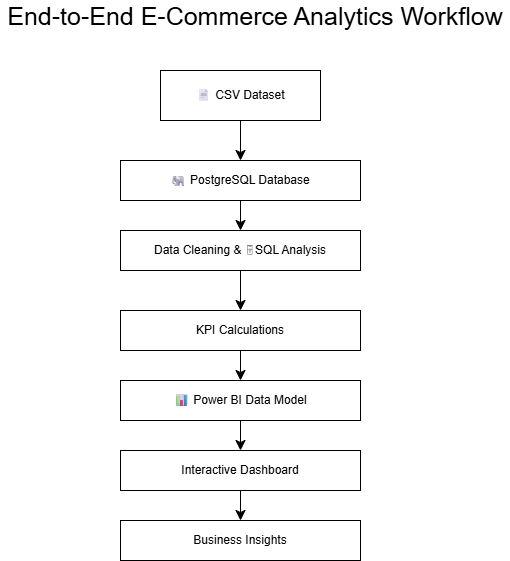
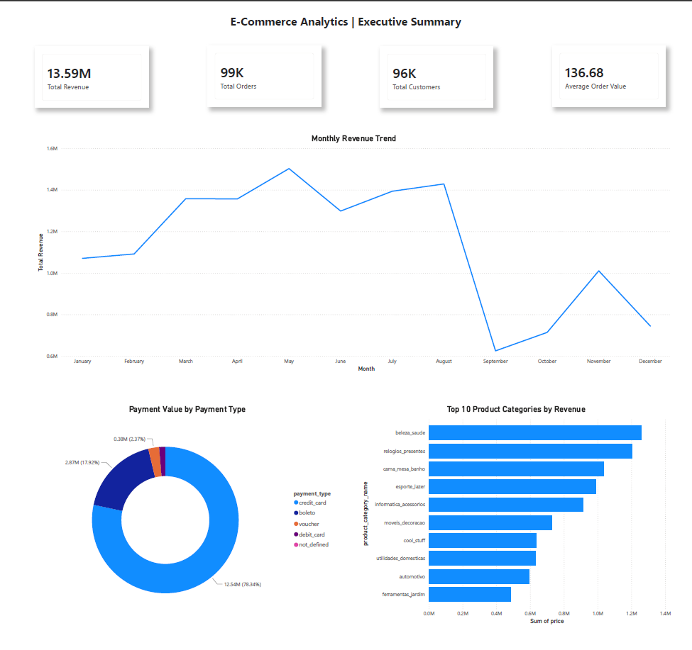
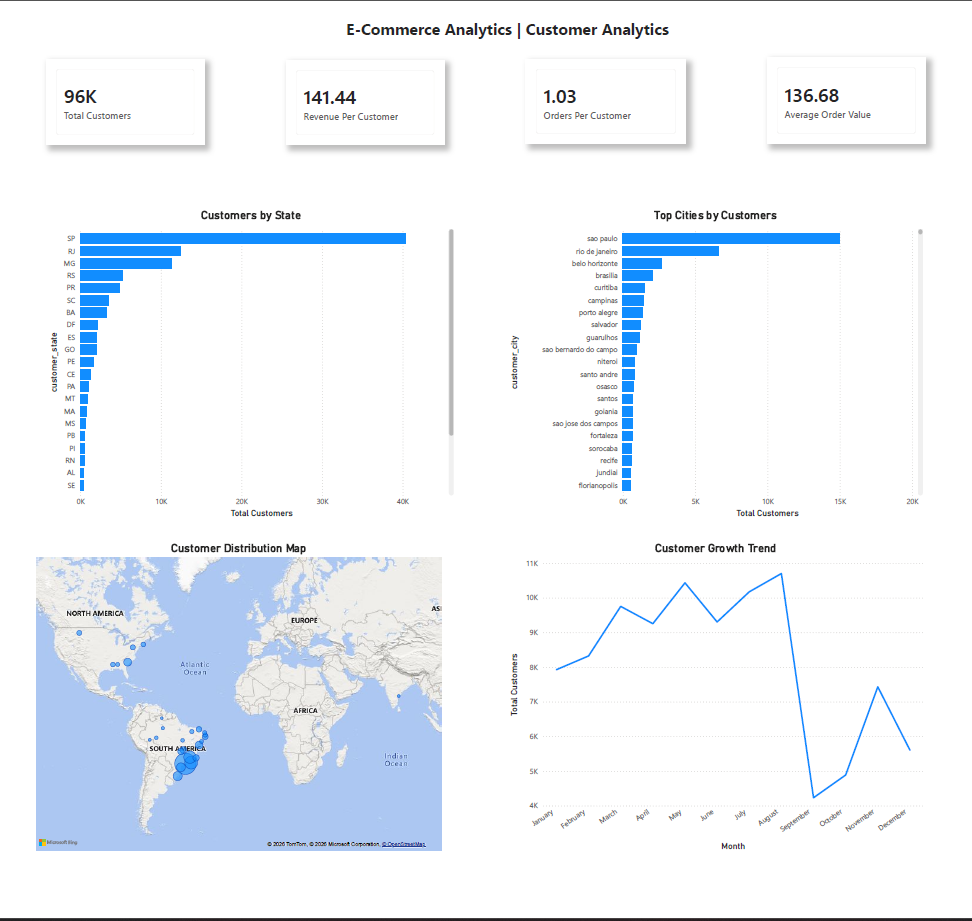
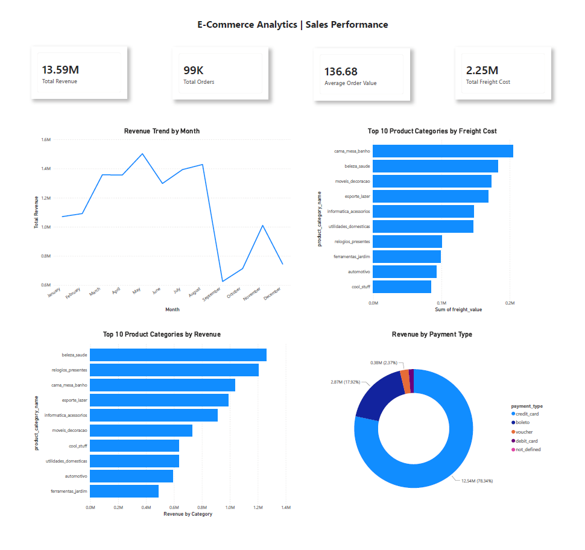

# E-Commerce Analytics Dashboard | Power BI

## Project Overview

This project presents an end-to-end E-Commerce Analytics Dashboard built using Power BI. The dashboard transforms raw transactional data into actionable business insights related to revenue, customer behavior, product performance, and sales trends.

---

## Tools Used

- Power BI
- PostgreSQL
- SQL
- DAX
- GitHub

---

## Dashboard Pages

### Executive Summary
- Revenue KPIs
- Monthly Revenue Trend
- Revenue by Payment Type
- Top Product Categories

### Customer Analytics
- Customer Distribution by State
- Top Cities by Customers
- Customer Growth Trend
- Customer Distribution Map

### Sales Performance
- Revenue Trend
- Freight Cost Analysis
- Product Category Performance
- Payment Analysis

---

## Key KPIs

- Total Revenue: 13.59M
- Total Orders: 99K
- Total Customers: 96K
- Average Order Value: 136.68
- Total Freight Cost: 2.25M
- Revenue Per Customer: 141.44
- Orders Per Customer: 1.03

---

## Key Business Insights

- Credit Cards contribute approximately 78% of total revenue.
- Top 3 product categories contribute around 30% of total sales.
- Customer acquisition peaked during August.
- São Paulo accounts for the largest customer base.
- Average customer places approximately 1.03 orders.

---

## Project Workflow

---
##Dashboard_Screenshots

## Executive Summary

## Customer Analytics

## Sales Performance

---

## Project File

Power BI Dashboard File:

Ecommerce_Analytics.pbix
